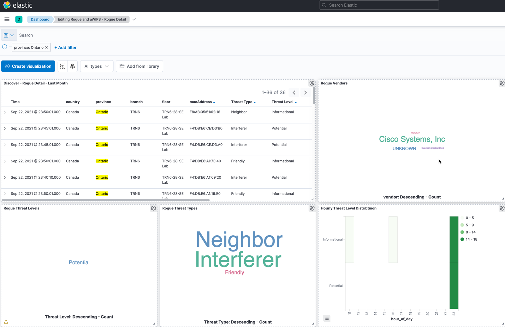

# DNA Center - Rogue Detail archiving script for long term retention in Elastic
Automated report generation for rogue devices detected by DNA Center, which exports data to Elastic stack and visualizes it with Kibana.  Exporting data from DNAC allows for longer storage and deeper data analysis. 

PLEASE NOTE: This snapshot copy of the repository. As the project evolves, the lastest code will be updated in the following repo:
https://github.com/imanassypov/dnac-elastic-retention


## Contacts
* Igor Manassypov   (imanassy@cisco.com)
* Andrew Dunsmoor  (adunsmoo@cisco.com)

## Solution Components
* DNA Center
* DNA Center Rogue Detection and Reporting
* Elastic Stack + Kibana
* Catalyst Wireless LAN Controller
* Catalyst Access Points

## Installation/Configuration
As highlighted above, this is a snapshot copy of the repo. For the latest code, see: https://github.com/imanassypov/dnac-elastic-retention

Clone repository to your local machine

```sh
 git clone https://github.com/imanassypov/dnac-elastic-retention.git
```

Complete the rename the *environment.env.sample* file to *environment.env* and complete with details of your Elastic and DNA Center instances

It is assumed that the script is run automatically at scheduled intervals (ie daily, monthly)

Required hardware: DNAC with managed Wireless Lan Controller and associated Access Points

## Requirements
- Elastic 7.14.1 (as tested)
- Kibana
- Python 3.9.7 (as tested)
- DNAC 2.2.2.3 (as tested)


## Features
- Script can be run on a schedule (ie crontab), collect Rogue Detail data from DNAC and upload to Elastic cluster
- Script will automatically create an Elastic Index if it does not exist
- Rogue MAC Address id is treated as a unique identifier when indexing to Elastic to avoid Rogue Entry duplication. Ie if the mac address of the rogue is already indexed, this entry will be updated in Elastic rather than created anew
- Each execution of the script is logged to local file 'application_run.log'
- The script will generate a snapshot of all Locations under 'Global' location hierarchy in DNAC. Further analysis / data slicing can be performed in Elastic/Kibana
- DNAC Report API requires submission of report payload as part of the call. Sample payload structures are included in this repository for reference
- Note: DNAC Report Payload includes 'filter' section, which allows for specification of various filters such as time range, location etc. Location filter supports a maximum of 254 elements, so when creating an API call for a Site Hierarchy element which contains more that 254 elements (ie buildings, floors etc) - report API request must be submitted in batches with 'location' filter populated with up to 254 floor elements
- Elastic Mapping schema used in the script leverages dynamic / runtime fields that calculate hour of day, and day of week to enable heatmap visualizations
- Script logic additionally breaks up the report supplied 'Location' string into individual fields when indexed into Elastic to allow for further per-location filtering (ie Country / City / Building / Floor etc)


## Supported intervals
- please note that minimum interval supported by DNAC for reporting purposes is 3 hours
- script supports following time intervals
- by default (with no supplied options) the script collects data for the previous day

```sh
--last 24hours|day|week|month|3month
```


## Sample CLI Execution
```sh
python3 dnacenter_archiver.py --verbose --last month

Connected to Elastic
Cluster name:   elastic
version:    7.14.1

Create Report App Run Start,  2021-09-23 11:58:58

Report name:
Threat Detail month 2021-08-31

Report dates:
2021-08-01 00:00:00
2021-08-31 23:59:59

Report Category: Rogue and aWIPS

Report View Group Id is: 97afe5c9-4941-4251-8bf5-0fb643e90841

Report View Name: Threat Detail

Report View Id is: 5057bfff-30bd-4a08-8439-82e4c957d367

Report submitted
Report id:  1ed9fce1-b2dd-47ce-8cf7-4a209c0f3d1a

Wait for report execution to start
!!!!!!!!!!!!!!
Operation took: 19.784386487 seconds

Report execution started, wait for process to complete
!!!!!!!!!!!!!!
Operation took: 20.058992730999996 seconds

Report execution completed
Report execution id:  34a4fb59-177a-4f49-8fa2-e298cb860545
Create Report App Run End
Operation took: 40.706254177 seconds
Elastic export completed.(32, [])
Operation took: 0.3002833649999985 seconds
```

## Scheduling the script to run automatically using cron
- following cron directive will run the script daily
- ensure path to your python3 is referenced correctly

```sh
crontab -e
@daily /usr/local/bin/python3 /Users/imanassy/Documents/Python/DNAC/dnac-elastic-retention/dnacenter_archiver.py --last day 2>&1

```

## Sample Elastic visualizations



## References
The original code for this script was forked from Gabi Zapodeanu's repo: https://github.com/cisco-en-programmability/dnacenter_reports_operations

### LICENSE

Provided under Cisco Sample Code License, for details see [LICENSE](LICENSE.md)

### CODE_OF_CONDUCT

Our code of conduct is available [here](CODE_OF_CONDUCT.md)

### CONTRIBUTING

See our contributing guidelines [here](CONTRIBUTING.md)

#### DISCLAIMER:
<b>Please note:</b> This script is meant for demo purposes only. All tools/ scripts in this repo are released for use "AS IS" without any warranties of any kind, including, but not limited to their installation, use, or performance. Any use of these scripts and tools is at your own risk. There is no guarantee that they have been through thorough testing in a comparable environment and we are not responsible for any damage or data loss incurred with their use.
You are responsible for reviewing and testing any scripts you run thoroughly before use in any non-testing environment.